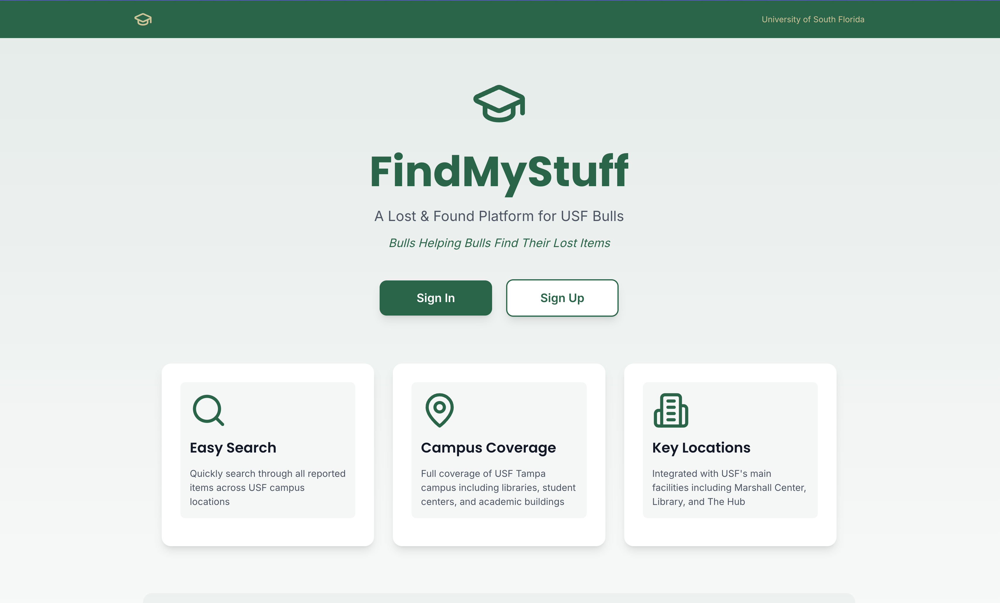
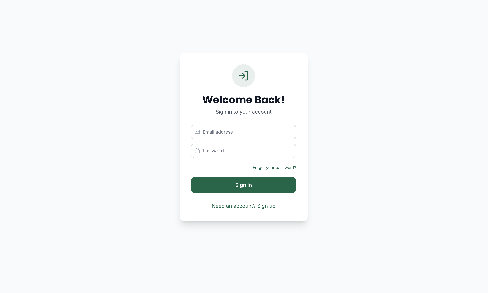
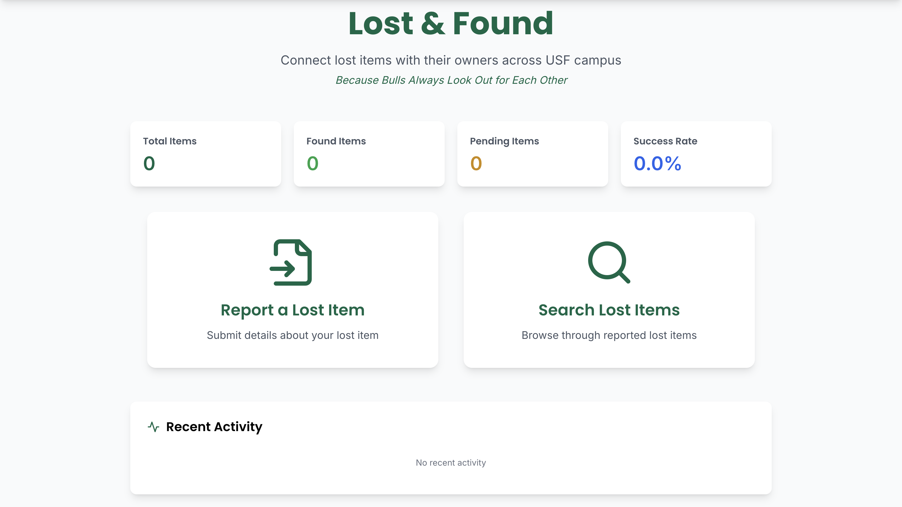
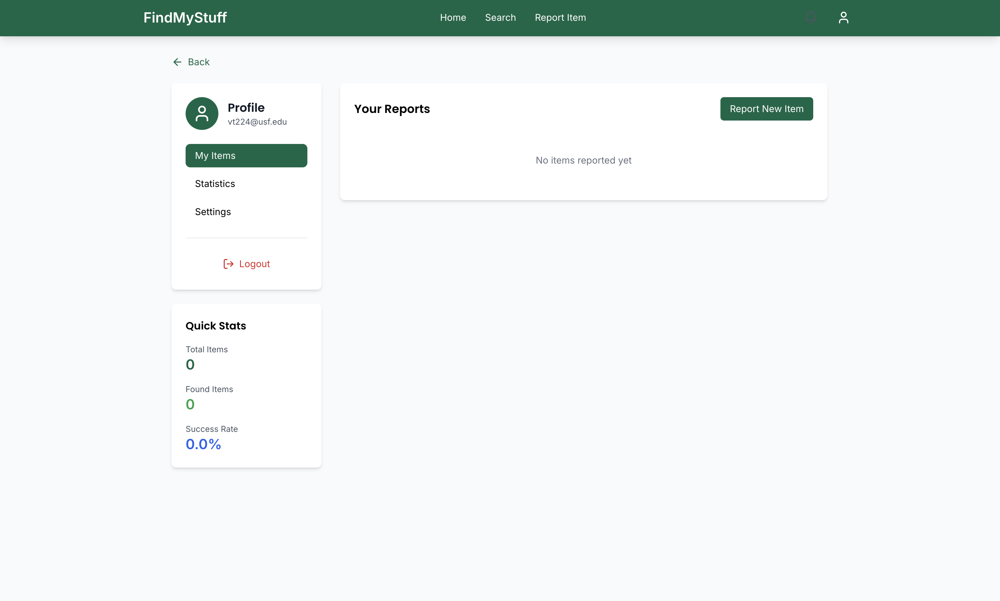
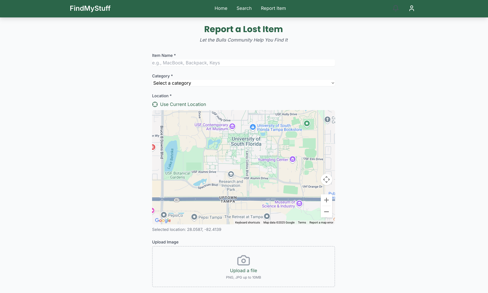
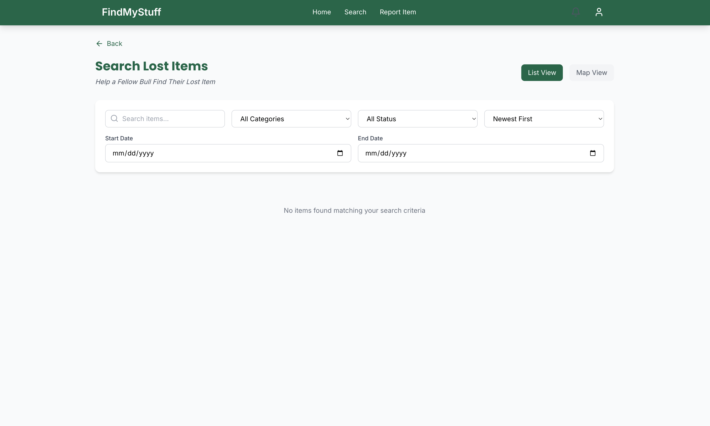

#  FindMyStuff@USF

🔗 [](https://guileless-kitsune-a510c3.netlify.app)

A modern web application built to help students at the **University of South Florida (USF)** report and find lost items around campus. Focused on enhancing the campus community by enabling real-time item tracking and easy communication between students. 📍🎒

---

## 🌟 Key Features

- 🔐 User authentication with email/password  
- 📍 Real-time lost item reporting with map-based locations  
- 🗺️ Interactive campus map using Google Maps  
- 🔎 Advanced search and filtering options  
- 🔔 Real-time notifications for matched or nearby items  
- 👤 User profiles to manage items  
- ✅ Track status of lost and found items  

---

## 🧰 Tech Stack

- **React 18 + TypeScript** (Frontend)
- **Node.js** (Backend)
- **PostgreSQL** (Database)
- **Supabase** (Authentication & Real-time updates)
- **Google Maps API** (Location mapping)
- **Tailwind CSS** (Styling/UI)


## ⚙️ Installation & Setup

Follow these steps to get the project running locally:

1. **Clone the Repository**

   ```bash
   git clone https://github.com/your-username/findmystuff-usf.git
   cd findmystuff-usf

2. **Install Dependencies**
   ```bash
   npm install

3. **Create Environment Variables**
   ```bash
   VITE_SUPABASE_URL=your-supabase-url
   VITE_SUPABASE_ANON_KEY=your-supabase-anon-key
   VITE_GOOGLE_MAPS_API_KEY=your-google-maps-api-key

4. **Start the Development Server**
   ```bash
   npm run dev

5. **Open the App in Your Browser**
   ```bash
   http://localhost:5173


## 🧑‍💻 App Walkthrough

A step-by-step visual guide to help you understand how **FindMyStuff - USF Lost & Found** works.

---

### 🏁 1. Welcome Screen

The landing page that introduces the platform and allows users to get started.



---

### 🔐 2. Sign Up Screen

New users can sign up with their university email and secure password.



---

### 🏠 3. Home Page

After login, users can search for items or report a new one right from the home dashboard.



---

### 👤 4. Profile Page

Users can manage all their submitted items and update their status.



---

### 📝 5. Report an Item

Users can report a lost or found item by entering details like category, description, and location.



---

### 🔎 6. Search for Items

Easily search for lost or found items using keywords, filters, or the interactive campus map.




